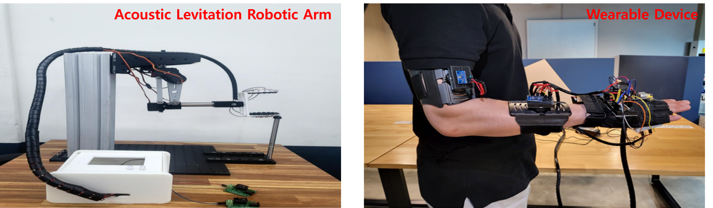
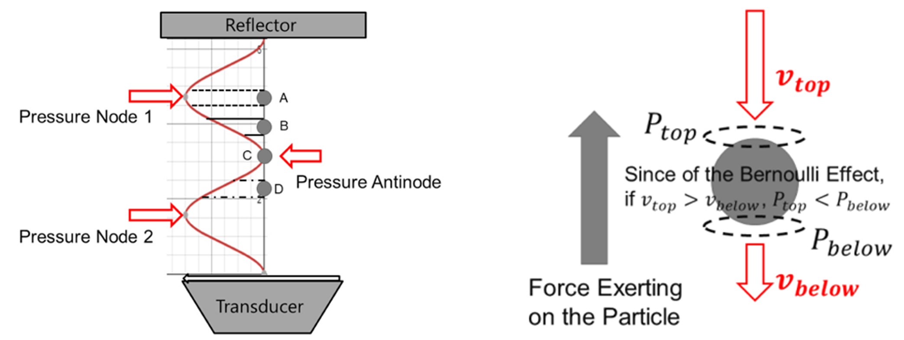
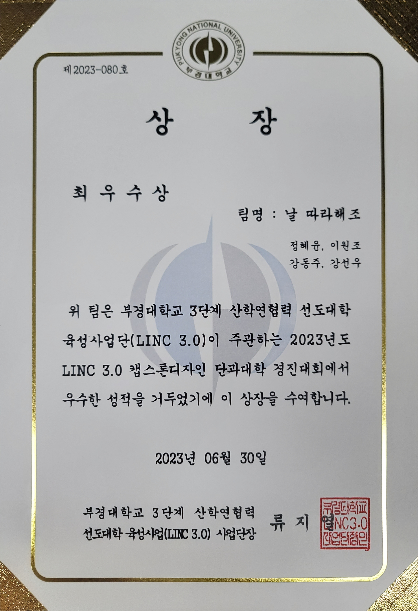

## Summary
#### 작품 목적 및 필요성 
: 해당 작품은 로봇암을 통해서 움직임의 가동성을 높이고, 모션 트레이싱 기술을 구현하여 직관적인 제어 인터페이스를 가진 Acoustic Levitation Robotic Arm 제작을 목표로 한다. 

#### 해결 방안 
: 결과물은 ‘1) 3개의 IMU 센서가 부착된 웨어러블 컨트롤러, 2) RRR structure 기반 5DOF 로봇 암, 3) 40kHz 초음파 부양기’로 총 세 가지 파트로 구성된다. 이로 로봇 암에 2mm 스티로폼 공 최대 5개를 부양시켜 팔 움직임을 모션 트레이싱 함을 성공하였다. 

#### 결과물 특장점 및 기대효과 
: 위 모듈의 추가 발전은 위험 물질 또는 섬세한 물질을 사용자가 떨어진 환경에서 정밀 작업 및contamination 없이 처리 할 수 있어 현재의 작업 구조에서 다른 방안을 제시함으로써 미래 산업 및 의료 시장에서 비접촉식 작업이 가능할 것으로 기대된다. 

## 과제의 목적, 개발동기 및 필요성
- 현재 초음파 기술은 의료기기 산업에 있어, 정확하고 신속한 비침습적 이미지 영상기술로 활용되고 있다.
- 이에 파생되어 영상기술이 아닌 미세 입자 혹은 특정 타겟에 대하여 물리력을 가하는 음향 공중부양 기술이 현재 주목을 이끌고 있다. 
- 이러한 기술은 음향 공중부양, 음향 집게, 초음파 햅틱 기술 등으로 인체 내부 혹은 외부에서 비접촉식으로 작은 부피의 타겟을 조작할 수 있다.
- 또한, 반응성이 높아 변화에 민감한 용액을 안정적으로 합성하거나 인체 내부에서 특정 물질을 의도한 곳으로 모이도록 활용할 수 있다.
- 이러한 기술들은 타겟을 미세하게 그리고 정확하게 조작할 수 있지만, 움직일 수 있는 범위가 한정되거나 방향이 제한적이라는 단점을 가진다.
- 이런 단점들을 개선하고 비접촉식 물질 조작의 의의를 극대화하기 위해서, 우리는 로봇암을 통해서 움직임의 가동성을 높이고, 모션 트레이싱 기술을 아두이노로 구현하여 보다 직관적인 제어 인터페이스를 가진 비접촉식 물질 조작 로봇암을 제작하였다. 

## 과제 내용

#### A. 음파 공중부양 (Acoustic Levitation) 
- 음향 부양 기술은 소형 물체가 음파의 정상파에서 압력 노드 부근에 위치할 때, 음향 방사힘이 중력, 부력이 평형을 이루며 공중 부양되는 현상을 말한다.
- 이 현상은 노드와 그다음 노드 사이의 특정 위치에서 발생하며, 이 위치에서는 중력과 반대 방향으로 작용하는 음향 방사력으로 인해 소형 입자가 힘의 평형을 이루게 되어 공중에서 정지하게 된다. (그림 1) 
- 음향 방사력이 발생하는 이유는 베르누이 원리에 따라, 음파 정상파에서는 소형 물체 주위의 유체의 속도가 변화하게 되면서, 중력과는 반대 방향으로 압력이 낮아지는 영역이 형성되어, 낮아진 압력이 음향 방사력을 유발한다. (그림 2)

**(그림 1. (좌) 음향 방사력으로 인한 입자 부양, (우) 베르누이 원리에 따른 음향 방사력 유발 원리)**

- 해당 파트는, Tinylev를 참고하여 상하 36개씩 총 72개의 10mm 크기와 40kHz 주파수를 가진 트랜스듀서를 이용해 hexagonal pattern으로 배치하였다. 
- 이론적으로, 40kHz 트랜스듀서의 경우, 공기 중 음파 파장이 8°C에서 약 65.25mm이므로 최대 약 4mm 크기의 샘플을 부양시킬 수 있다. 
- 결과물은 반지름을 변화시켜 Trapping force를 높여 약 2mm 스티로폼 최대 5개를 부양하였다. 

#### B. 5DOF Robotic Arm
- 해당 파트는, ‘DIY Robot arm kit 6 DOF’을 참고하여, Grabbing Handle 부분과 1개의 서보모터를 제거하고 5개의 MG995R 모터와 일부 프레임을 변형하여 5 DOF robotic arm을 구현하였다.
- Robotic arm은 회전 관절로만 움직이는 RRR structure 형태의 Articulated Robot이다.
- 각 관절은 5개의 서보모터를 통해 회전(revolute) 움직임을 주며, 인체의 손목에 해당하는 관절은 360도로 가장 큰 가동범위를 보이며, 나머지 모터들은 대략 120~150 정도의 가동범위를 가진다.
- 크게 13개의 프레임을 솔리드웍스로 디자인하였으며, 모터의 토크를 감당하지 못하여 뒤틀림(distorting) 현상이 발생하는 일부 프레임은 금속으로 나머지는 전부 3D printing을 통한 플라스틱 프레임으로 제작하여 조립하였다.

#### C. 웨어러블 컨트롤러 
- 해당 파트는, 3개의 IMU 센서를 이용해서 로봇암을 움직이게 하는 부부이다.
- IMU 센서란 물체가 기울어진 각도를 정확하게 측정하는 관성 측정 장치로, 상완근에 부착된 1번 IMU 센서는 상완의 x축 회전을, 전완근에 부착된 2번 센서는 전완의 x축, z축을 담당. 3번 센서는 손등의 x, y축의 회전을 감지한다.
- 각 센서로 얻은 축 값은 1:1로 매칭된 스텝모터(로봇암)로 데이터를 송신하여 로봇팔이 사람과 동일하게 움직일 수 있도록 컨트롤이 가능해진다.

## 기대효과 및 활용 방안
- 현재 Acoustic levitation 기술은 R&D 분야에서 크기가 수 밀리미터에 불과한 아주 작은 물체를 부상시키는 것을 중점으로 연구가 진행되어 오고 있다.
- Acoustic Levitation을 활용한 비접촉식 작업이 가능한 물질은 ‘마이크로칩, 비전도성 재료, 고순도 재료, 화학 반응물, 생물학적 분석 시료’와 같이 작고 섬세한 물체로 보고 있으며, 이를 정밀 작업 및 contamination 없이 처리할 수 있을 것으로 기대된다.
- 또한, Tracking 기술을 접목한 협동 로봇(Collaborative Robot)으로써, 사용자가 위험물질과 떨어진 환경에서 안전하게 공동 작업을 수행할 수 있다. 
- 협동 로봇은 Statista의 시장조사 보고서에 의하면 시장 규모는 2020년 4억 달러, 2022년 8억 달러로, 연간 43.4%(CAGR) 증가해 2030년 80억 달러에 달할 것으로 전망하는 등 유망한 시장이다. 
- 따라서, 확장되는 협동 로봇과 함께 해당 결과물인 Acoustic Levitation Robotic Arm의 발전은 미래 산업 및 의료시장에서 비접촉식 작업이 가능한 기계의 기초 모듈이 될 것이라 기대한다.

## References

1. 박민철 외 2 (2018), “베르누이 원리와 bolt-clamped Langevin type 초음파 진동자를 이용한 정상파 음파 공중부양의 탐구”, 한국음향학회지.
2. Asier Marzo et al (2017), “TinyLev: A multi-emitter single-axis acoustic levitator”, AIP Publishing.
3. Adem Ozcelik et al (2018), "Acoustic tweezers for the life sciences", nature methods.
4. 이준명 (2021), “협동 로봇: 중소기업 스마트 제조의 시작점”, 한국무역협회 국제무역통상연구원.
5. UpnaLab(2022) "Acoustic Levitator", https://www.instructables.com/Acoustic-Levitator/

## 수상

